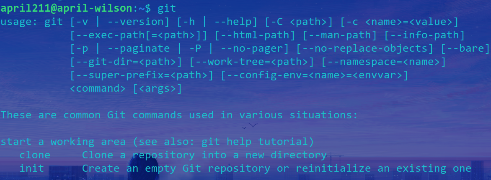

# 在 ubuntu 下对 git 进行简单的配置

2023/7/4 - april211

## 前言

其实之前在大学阶段学习过 `git` 的一些基本用法，也使用过它来进行一些仓库的版本控制。但是当时的任务并没有涉及到多人协作的内容，知识的学习不是很扎实；另一方面是当时没有养成记录、写 Blog 的习惯，许多基础概念已经模糊不清，现在还是比较后悔的。

幸好之前在学习 `git` 时，还留下了一些学习资料。这次配置就是参考了之前的资料完成的。

## 基本情况

放一张我的机器的信息页。


（PS：系统字体是 `Comic Sans MS Italic`）

`which git` 输出：

```
/usr/bin/git
```

此时，如果在 `Terminal` 中执行 `git` 命令行，将会出现如下类似提示性输出。



## 配置过程

本篇主要是对 `git` 的全局用户名和电子邮箱进行了配置，参考 [博客链接](https://www.cnblogs.com/duanming/p/11830252.html)。

主要是使用下面的两行命令来完成：

`git config --global user.name "april211"`

`git config --global user.email "wuguangkai2018@outlook.com"`

在配置完成后，可以使用 `git config user.name` 以及 `git config user.email` 进行确认，如下图。


参考博客中使用的是 Windows 环境，我之前学也是在 Windows 下进行的，并选择使用 `Git Bash` 执行命令，过程上是大同小异的。另外，该文还讲解了重新设置用户名和电子邮箱的方法，在上面命令行的基础上额外添加 ` --unset` flag 即可。

