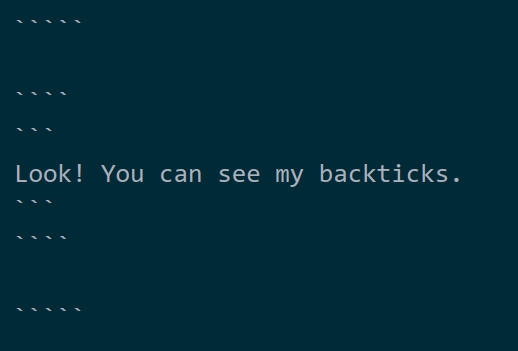

# 代码语法

## 基本用法

> 要将单词或短语表示为代码，请将其包裹在反引号 (`) 中。

参考 [官网示例代码](https://markdown.com.cn/basic-syntax/code.html#markdown-%E4%BB%A3%E7%A0%81%E8%AF%AD%E6%B3%95)，给出如下示例：

```
At the Terminal window, type `vim` and hit `Enter`.
```

对应的渲染效果：

At the Terminal window, type `vim` and hit `Enter`.

可以通过上面的示例，体会一下多个 `` ` `` 的配对原则。

## 代码中有反引号？

当代码中包含反引号时，代码**使用两个反引号**包含起来，其内部的所有的单个反引号均视为单纯的字符。

参考 [官网示例](https://markdown.com.cn/basic-syntax/code.html#%E8%BD%AC%E4%B9%89%E5%8F%8D%E5%BC%95%E5%8F%B7)，给出如下的示例代码：

```
something else... ``Use `code` in your Markdown file.`` something else...
```

代码的渲染效果如下：

something else... ``Use `code` in your Markdown file.`` something else...

## 创建代码块

[Markdown 官方教程 - 代码块](https://markdown.com.cn/basic-syntax/code.html#%E4%BB%A3%E7%A0%81%E5%9D%97) 指出：

> 要创建代码块，请将代码块的每一行缩进至少四个空格或一个制表符。

官网给出的示例：

```


    <html>
      <head>
      </head>
    </html>

```

代码渲染效果如下：

    <html>
      <head>
      </head>
    </html>

**注意**: 

- 代码块要**形成一个段落**，即在纯文本下，代码块以一个空行开始，并以一个空行结束。
- 如果想要不使用缩进来创建代码块，并增加**语法高亮**功能，考虑使用 [围栏式代码块](#创建受保护的代码块并使用高亮)（**Fenced Code Blocks**）。

## 创建受保护的代码块，并使用高亮

*注意：受保护的代码块（围栏代码块）语法被 Markdown 官网列为扩展语法，使用时应当先查看自己所用的语法解释器 (parser) 的说明书。*

[Markdown 官方教程 - Markdown 围栏代码块](https://markdown.com.cn/extended-syntax/fenced-code-blocks.html#markdown-%E5%9B%B4%E6%A0%8F%E4%BB%A3%E7%A0%81%E5%9D%97) 指出：

> Markdown基本语法允许您通过将行缩进四个空格或一个制表符来创建代码块。如果发现不方便，请尝试使用受保护的代码块。根据Markdown处理器或编辑器的不同，您将在代码块之前和之后的行上使用三个反引号（```）或三个波浪号（~~~）。
> 
> ...
>
> 许多Markdown处理器都支持受围栏代码块的**语法突出显示**。您可以使用此功能为编写代码的任何语言添加颜色突出显示。**要添加语法突出显示，请在受防护的代码块之前的反引号旁边指定一种语言**。

下面借用官方教程给出的 JSON 代码，对比高亮处理前后的渲染效果。

这是经过高亮处理的 JSON 代码：

```json
{
  "firstName": "John",
  "lastName": "Smith",
  "age": 25
}
```

对比没有高亮的代码（使用 4 字符缩进来构造）：

    {
      "firstName": "John",
      "lastName": "Smith",
      "age": 25
    }

可见受保护的代码块提供了高亮显示，提升了代码的阅读体验。

Github 官方使用 Linguist 进行语法渲染[^github_syntax]。

> We use Linguist to perform language detection and to select third-party grammars for syntax highlighting. You can find out which keywords are valid in the languages YAML file.

如果想知道具体可以使用哪些编程语言的名称（例如上面的 `json` ），请查阅 [此链接](https://github.com/github-linguist/linguist/blob/master/lib/linguist/languages.yml) 。

[^github_syntax]: [Github Docs - Syntax Highlighting](https://docs.github.com/en/get-started/writing-on-github/working-with-advanced-formatting/creating-and-highlighting-code-blocks#syntax-highlighting) 

如果你想在受保护的代码块中使用三个连续的 `` ` ``，你需要将位于外层的 backticks 个数调整为 4。

[Github 官方文档](https://docs.github.com/en/get-started/writing-on-github/working-with-advanced-formatting/creating-and-highlighting-code-blocks#fenced-code-blocks) 中的示例代码：

`````

````
```
Look! You can see my backticks.
```
````

`````

渲染效果：

````
```
Look! You can see my backticks.
```
````

实际上，你不需要将外层的 backticks 一定调整为 4 个，只需要**让外层的个数大于相邻的内层 backticks 个数、并相互配对**即可。这也是我能展示上面的示例代码的原因。我在 Markdown 原始文本中的代码如下图，其中最外层使用了 5 个 backticks 并相互配对。



