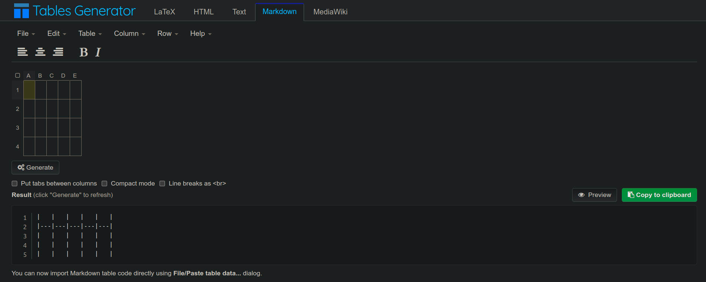
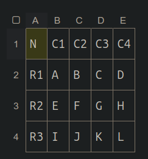
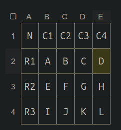

# 表格语法

*注意：表格语法被 Markdown 官网列为扩展语法，使用时应当先查看自己所用的语法解释器 (parser) 的说明书。*

## 手动方法

完全可以通过手打 Markdown 的方法来构造表格，如下：

| Col1 | Col2 |
| ---- | ---- |
| A    | B    |
| C    | D    |

并且可以使用 `:` 来**控制表格某一列的对齐方式**（左对齐、居中对齐、右对齐），如下：

| Col1  |  Col2  | Col3 |
| :---- | :----: | ----:|
| A     |    B   |    C |
| D     |    E   |    F |

但是会发现这样做**有如下问题**：

- 这很耗时费力
- 要保持原始文本一样规整并不是一件轻松的事
- 修改表格内容后，需要重新调整表格，以保持美观
- ...

尽管你可以这样书写表格，这并不会影响 Markdown 渲染的结果：

| Col1 |Col2 |
| --- | -- |
|       A    | B    |
| C    |     D    |

但是这会让 Markdown 原始文本的可读性大大下降，与 Markdown 语法的设计初衷相违背。

## 自动生成方法

由于手工方法存在各种问题，有人制作了表格代码生成工具：[Markdown Tables Generator](https://www.tablesgenerator.com/markdown_tables)。

这个工具允许用户可视化地编辑和设定表格的内容和格式，并一键生成表格对应的 Markdown 代码。其初始界面如下图。



这是页面下方给出的使用指导：

> How to use it?
> 
> 1. Using the Table menu set the desired size of the table.
> 
> 2. Enter the table data into the table:
> 
>     - select and copy (Ctrl+C) a table from the spreadsheet (e.g. Google Docs, LibreOffice Calc, webpage) and paste it into our editor -- click a cell and press Ctrl+V
>     - or just double click any cell to start editing it's contents -- Tab and Arrow keys can be used to navigate table cells
> 
> 3. Adjust text alignment and table borders using the options from the menu and using the toolbar buttons -- formatting is applied to all the selected cells.
> 
> 4. Click "Generate" button to see the generated table -- select it and copy to your document.

例如我们可以手工键入表格内容如下：



随后，我们通过按住 `Ctrl` 键，连续选中所有列，并点击居中按钮，使得表格内容居中显示，如下图。



最后，点击表格下方的 `Generate` 按钮，生成表格代码如下：

```
|  N | C1 | C2 | C3 | C4 |
|:--:|:--:|:--:|:--:|:--:|
| R1 |  A |  B |  C |  D |
| R2 |  E |  F |  G |  H |
| R3 |  I |  J |  K |  L |
```

可见生成了我们想要的代码。这块代码在我的环境中渲染如下：

|  N | C1 | C2 | C3 | C4 |
|:--:|:--:|:--:|:--:|:--:|
| R1 |  A |  B |  C |  D |
| R2 |  E |  F |  G |  H |
| R3 |  I |  J |  K |  L |

效果还是很不错的:)

## 如何在表格中显示竖线符？

可以使用 HTML 字符代码（&#124;）在 **Markdown 表格中**显示竖线（|）字符，例如下面的示例：

| Col1 |   Col2   |
| ---- | -------- |
| A    | B&#124;= |
| C    | D&#124;= |

